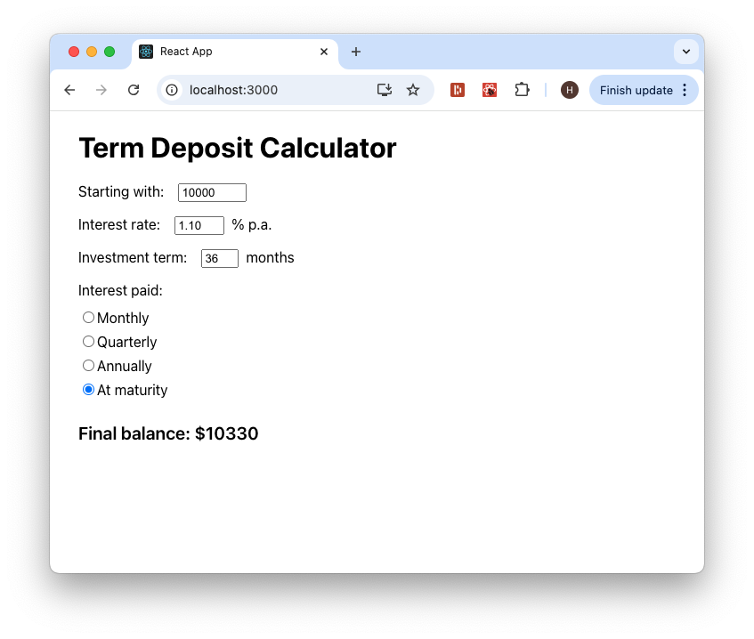

# Term Deposit Calculator

This is a simple term deposit calculator. Users input their starting amount,
interest rate, investment term and interest paid frequency via the UI (see
screenshot below) and the final balance is displayed. This app was built with
[React](https://react.dev/), [Create React App](https://create-react-app.dev/),
and [TypeScript](https://www.typescriptlang.org/).



## Development

### System Requirements

- [NodeJS](https://nodejs.org) `>=16`
- [npm](https://www.npmjs.com/) v8.16.0 or greater

### Install Dependencies

In the project's root directory run:

```shell
npm install
```

### Running the App

In the project's root directory run:

```shell
npm start
```

Open http://localhost:3000 to view the app in the browser.

### Running the tests

In the project's root directory run:

```shell
npm test
```

This will start [Jest](https://jestjs.io/) in the interactive watch mode.

To run the tests with coverage reporting run:

```shell
npm test -- --coverage --watchAll
```

## Assumptions

### Input Validation

Input validation was assumed to match the
[Bendigo Bank Term Deposit Calculator](https://www.bendigobank.com.au/calculators/deposit-and-savings/)
(e.g. starting amounts must be between $1000 and $1,500,000).

### Final Balance

The final balance has been rounded to the closest dollar following the Bendigo
Bank example.

## Tradeoffs

### User Experience

Due to the time limit tradeoffs were made concerning user experience. For
example, the investment term field requires users to input the term in months
rather than years and months.

### Accessibilty

Accessibility was sacrificed due to the time limit and should be addressed prior
to any release. Users interacting with the app via a screenreader may be
confused regarding some of the fields, either due to their label being unclear
(e.g. 'Starting with:') or the label being broken up by the text input (e.g.
'Interest rate: [text input] % p.a.).

### Error Handling

Handling invalid input errors is currently handled by the
`calculateFinalBalance` function. If invalid values are inputted the function
will throw an error with a message that is displayed to the user (see screenshot
below). A better approach would be to validate fields individually within their
`onChange` handler as it would allow for a better user experience regarding form
validation (e.g. resetting invalid fields to either their min or max value like
the Bendigo Bank example) and prevent unnecessary calls to
`calculateFinalBalance`. This approach was not implemented as it would have
taken a significant amount of time and departs from the suggested simple UI.


## Design Decisions

Overall, it was decided to keep the app as simple as possible due to the time
limit and it being intended as a conversation starter rather than a production
ready application. Flexibility to grow the app with further requirements is
maintained by avoiding hasty abstractions and premature optimatisations at this
early stage.

## Known Bugs

All fields are required, however if the interest rate field is left empty an
error message does not currently display (see screenshot below).


